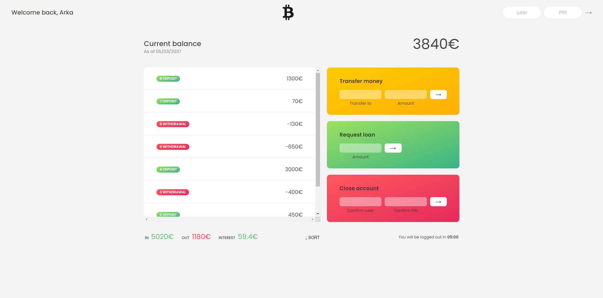

# bankAR (Bank Management System)

This website is a online money transfer portal where beneficiary can log-in and transfer money to other's account, request a loan, and also can close the account by confirming his/her net banking credentials.


## Screenshot




## Run Locally

Clone the project

```bash
  git clone https://github.com/softdevarka/bank-AR.git
```

Go to the project directory

```bash
  cd bank-AR
```

Install Live-Server. You need node.js and npm. You should probably install this globally.

```bash
  npm install -g live-server
```

Start the server

```bash
  live-server
```


## 🔗 Links
[](https://softdevarka.netlify.app/)
[](https://www.linkedin.com/in/softdevarka/)
[](https://twitter.com/softdevarka)

